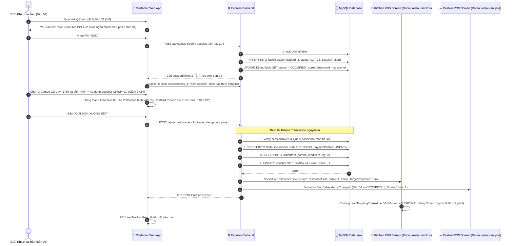
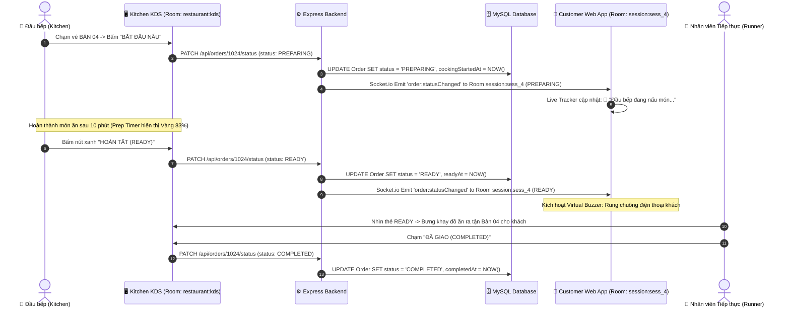
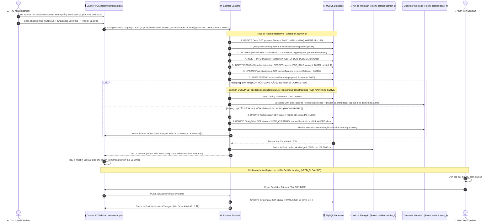
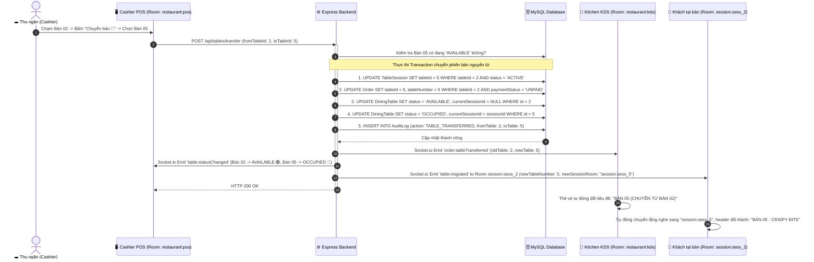
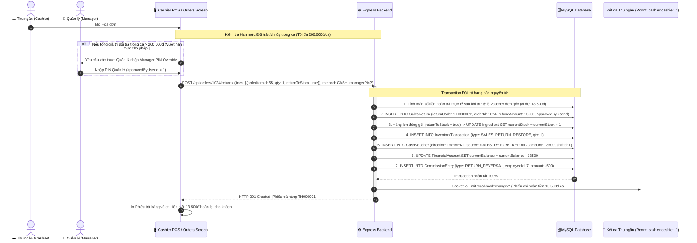
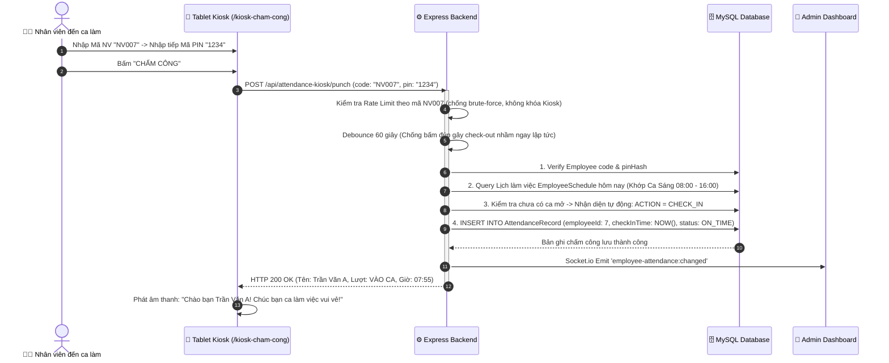
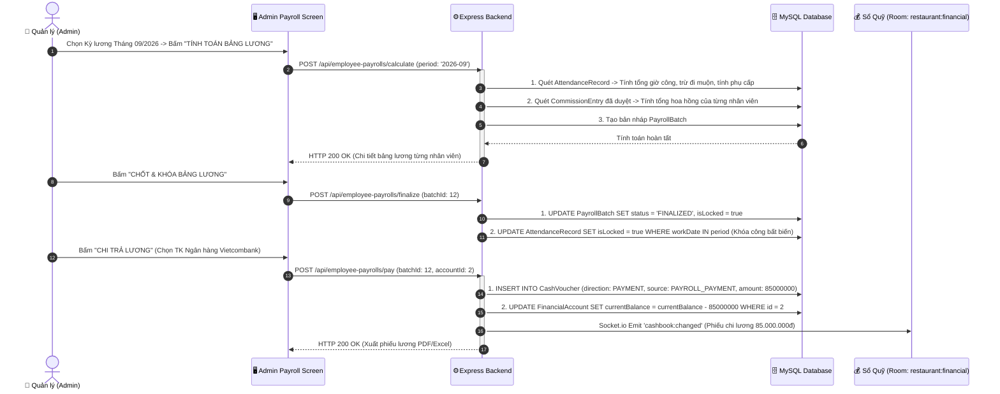
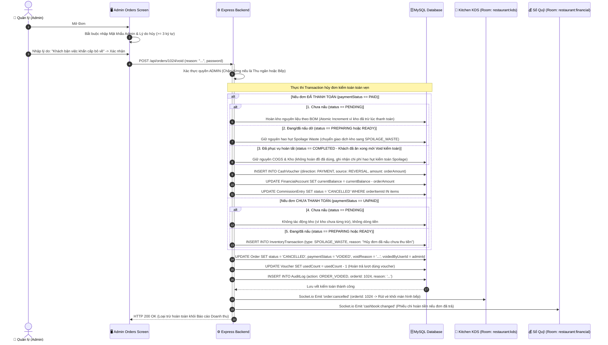

# 📋 ĐẶC TẢ PHÂN TÍCH THIẾT KẾ PHẦN MỀM & KỊCH BẢN THAO TÁC NGƯỜI DÙNG (SRS & SDD)
## HỆ THỐNG NHÀ HÀNG FAST FOOD & SMART DINE-IN "CRISPY BITE" (ENTERPRISE QSR ECOSYSTEM)

> **Mục đích tài liệu**: Tài liệu kết hợp giữa **Đặc tả Hệ thống Thực thi Hiện hành (As-Built Specification)** và **Thiết kế Kiến trúc Mở rộng (Roadmap Architecture)** cho Hệ sinh thái Doanh nghiệp Crispy Bite QSR.  
> Tài liệu chuẩn hóa mô hình vòng đời Bàn - Phiên phục vụ - Đơn hàng, quy chuẩn kế toán dòng tiền, thuế VAT theo thực tiễn F&B Việt Nam, và phân định minh bạch giữa các tính năng đã cài đặt trong mã nguồn `[CODE]` và các tính năng định hướng kiến trúc `[ROADMAP]`.  
> **Phiên bản**: 5.7 - Bản Đặc Tả Hệ Thống Minh Bạch & Chuẩn Hóa Vận Hành (Transparent Specification & Operational Standards).  
> **Ngày cập nhật**: 2026-10-07.  
> **Bảo chứng chất lượng kiểm thử**: Toàn bộ tính năng cốt lõi hiện hành được kiểm chứng bởi **1,113 automated tests (824 backend + 289 frontend) PASS 100%** trên nền tảng 33 migrations Prisma.

---

## 🧭 1. TỔNG QUAN HỆ THỐNG & MA TRẬN PHÂN QUYỀN TRUY CẬP (RBAC)

### 1.0. Bảng Đối Soát Minh Bạch: Hiện Trạng Mã Nguồn [CODE] vs Đặc Tả Mở Rộng [ROADMAP]
Để đảm bảo tính trung thực kỹ thuật giữa mã nguồn đang chạy và tài liệu định hướng kiến trúc, hệ thống xác lập ranh giới phân định minh bạch như sau:

| Khối Nghiệp vụ | Hiện trạng Mã nguồn [CODE - ĐÃ CÀI ĐẶT & TEST 100%] | Mô hình hóa Đặc tả [ROADMAP - KIẾN TRÚC MỞ RỘNG] |
| :--- | :--- | :--- |
| **Quản lý Bàn & Đơn hàng** | • Quản lý vòng đời bàn qua `DiningTable` với 4 trạng thái (`AVAILABLE`, `OCCUPIED`, `NEED_CLEANING`, `RESERVED`).<br>• Cho phép 1 bàn chứa nhiều `Order` chưa thanh toán (`paymentStatus: UNPAID`), tính tổng nợ gộp.<br>• Khi thanh toán đơn (`payOrder`), nếu hết đơn nợ server chuyển bàn sang `NEED_CLEANING`.<br>• Nút "Xác nhận đã dọn bàn" trên POS chuyển bàn về `AVAILABLE`.<br>• Chuyển bàn nguyên tử (`/api/tables/transfer`) kèm AuditLog và Socket real-time. | • Tách bạch trạng thái trung gian `PAID_AWAITING_SERVE`: Giữ nguyên bàn `OCCUPIED` và Live Tracker cho đến khi toàn bộ món chuyển `COMPLETED` rồi mới sang `NEED_CLEANING`.<br>• Trừu tượng hóa thực thể riêng `TableSession` và `OrderInvoice` (Bill tổng nhiều Order). |
| **Mã QR Bàn & Phiên Khách** | • Tem QR bàn bảo mật có mã xác thực `qrCodeToken` theo bàn vật lý.<br>• Endpoint an toàn `/api/tables/by-number/:tableNumber` trả về thông tin bàn và token.<br>• Giỏ hàng khách hàng lưu trữ cục bộ, hỗ trợ theo dõi đa đợt gọi món (`#ORD-001`, `#ORD-002`). | • Chuẩn hóa Tem QR URL cố định vật lý `/t/4` (không in lại tem mỗi lượt khách).<br>• Khách quét QR xong kích hoạt phiên bằng mã PIN 4 số sinh ngẫu nhiên theo phiên (hết hạn 15p, rate-limit 5 lần) hoặc Thu ngân bấm "Mở bàn" trên POS.<br>• Hủy session token khi bàn chuyển sang `NEED_CLEANING`. |
| **Thuế VAT & Giá niêm yết** | • Đơn hàng tính VAT 8% cộng trên Doanh thu sau khi trừ Voucher (`taxableAmount = Math.max(0, subtotal - discountAmount)`).<br>• Hiển thị chi tiết tiền món, giảm giá voucher, VAT và tổng thanh toán. | • Chuẩn hóa niêm yết giá B2C trên Menu là giá ĐÃ GỒM VAT (Gross Price) theo tập quán F&B Việt Nam, bóc tách ngược thuế khi in bill.<br>• Bảng cấu hình `TaxRateConfig` theo danh mục/món: 8% món ăn chế biến sẵn (hết hạn 31/12/2026), 10% đồ uống có cồn chịu thuế TTĐB. |
| **Ca Thu ngân & Két tiền** | • Toàn bộ giao dịch liên thông Sổ quỹ (`Cashbook`), ghi nhận Phiếu thu/chi tự động (`CashVoucher`) vào tài khoản Tiền mặt / Ngân hàng theo thời gian thực.<br>• Dashboard hiển thị thẻ "Phân bổ thanh toán & Chốt két" (CASH vs BANK). | • Mô hình hóa thực thể `CashierShift` với quy trình bắt buộc nhập Tiền lẻ đầu ca (Opening Float) và đếm tiền thực tế chốt ca (Closing Cash) tính chênh lệch Cash Variance.<br>• Bổ sung dòng cấn trừ cọc (`RESERVATION_DEPOSIT_OFFSET`) trong đối soát tiền ca. |
| **Bếp KDS & Hoàn tác** | • Vòng đời 4 bước FSM: `PENDING` $\rightarrow$ `PREPARING` $\rightarrow$ `READY` $\rightarrow$ `COMPLETED`.<br>• Chặn nhảy cóc FSM (409 nếu nhảy cóc).<br>• Phân quyền Cashier chỉ được giao món `COMPLETED` (403 nếu cố bấm `PREPARING`/`READY`).<br>• Hoàn tác `READY -> PREPARING`: Frontend có nút đếm ngược 10 giây; Backend khóa cứng guard timeout 60 giây.<br>• Báo hủy bếp 1 chạm (`KITCHEN_WASTE`), Ticker cảnh báo NVL. | • Cấu hình thời gian nấu chuẩn `targetPrepMinutes` theo từng danh mục món ăn trong CSDL; tính thời gian vé bếp theo món có thời gian nấu lớn nhất (`Math.max`). |
| **Kho, BOM & Void Order** | • Trừ kho tự động theo định lượng BOM khi đơn chuyển `PAID`.<br>• Cho phép bán âm kèm thuật toán bù trừ net-positive không méo mó giá vốn bình quân (WAC).<br>• Admin Void yêu cầu mật khẩu và lý do $\ge 3$ ký tự, tự động hoàn lượt dùng voucher nếu đơn bị hủy hoặc hết hạn (60p). | • Chuẩn hóa Ma trận Kho 2 chiều khi Void Order cho cả 5 trường hợp (gồm cả `PAID + COMPLETED`).<br>• Đơn trả trước (`PAID`) hủy lúc `PENDING` bắt buộc hoàn kho nguyên liệu; Đơn `PREPARING/READY/COMPLETED` giữ nguyên hao hụt `SPOILAGE_WASTE`. |

### 1.1. Bối cảnh & Mô hình Vận hành Doanh nghiệp QSR Fast Casual
Hệ thống **CRISPY BITE** được xây dựng trên nền tảng kiến trúc doanh nghiệp F&B, tích hợp chặt chẽ giữa trải nghiệm khách hàng không ma sát (Zero-Friction Customer Experience), chuỗi cung ứng khép kín, quản trị nhân sự (HRM) và sổ cái tài chính dòng tiền (Cashbook Ledger):
* **Cấu trúc Bàn ăn & Vòng đời Phiên phục vụ (Table & Session Lifecycle)**:
  - Bàn ăn vật lý (`DiningTable`) phục vụ khách qua vòng đời trạng thái chuẩn mực F&B:
    $$\text{AVAILABLE (Trống 🟢)} \xrightarrow{\text{Mở bàn/Đặt món}} \text{OCCUPIED (Đang ăn 🔴)} \xrightarrow{\text{Đã trả tiền nhưng món đang nấu}} \text{PAID\_AWAITING\_SERVE (Chờ đủ món 🟠)}$$
    $$\xrightarrow{\text{Đã trả tiền \& Đã ra đủ món COMPLETED}} \text{NEED\_CLEANING (Chờ dọn 🟡)} \xrightarrow{\text{Nhân viên bấm Đã dọn}} \text{AVAILABLE (Trống 🟢)}$$
  - Bàn ăn tuyệt đối không nhảy cóc từ `OCCUPIED` thẳng về `AVAILABLE` khi chưa qua bước dọn dẹp vệ sinh an toàn thực phẩm.
  - Hỗ trợ 1 bàn chứa nhiều đợt gọi món (`Order` #1, #2, #3...) và thanh toán gộp toàn bộ dư nợ.
  - Khách thanh toán tiền sớm trong khi món còn đang nấu: Bàn chuyển sang trạng thái trung gian `PAID_AWAITING_SERVE`, Live Tracker và `sessionToken` của khách **vẫn duy trì hoạt động bình thường** cho đến khi món cuối cùng hoàn tất `COMPLETED`.
* **Phương thức Bán hàng Đa kênh**:
  - 🍽️ **Tại bàn (`DINE_IN`)**: Khách tự quét mã QR tại bàn hoặc Thu ngân mở bàn tại quầy. Hỗ trợ linh hoạt cả **Trả sau (Post-paid)** và **Trả trước (Pre-paid)**.
  - 🛍️ **Mang về (`TAKE_AWAY`)**: Mặc định **Trả trước 100% tại quầy**, cấp thẻ rung lấy món hoặc gọi số hóa đơn.
  - 🚚 **Giao hàng (`DELIVERY`)**: Kết nối Đối tác vận chuyển (*GrabFood, ShopeeFood*), theo dõi công nợ phải thu của đối tác sau khi đã trừ chiết khấu hoa hồng nền tảng.
* **Thời gian thực chuyên biệt theo phân vùng (Partitioned Real-Time Rooms)**:
  - Phân tách rõ ràng giữa các luồng sự kiện Socket.io bảo mật:
    * `restaurant:kds`: Màn hình Bếp KDS chỉ nhận vé nấu ăn (tuyệt đối không nhận dữ liệu tài chính hay hoa hồng).
    * `restaurant:pos`: Máy POS thu ngân nhận sự kiện cập nhật trạng thái bàn, đơn hàng mới và yêu cầu thanh toán.
    * `cashier:{userId}`: Kênh thông báo biến động dòng tiền và két ca dành riêng cho từng thu ngân.
    * `restaurant:financial`: Phòng bảo mật cấp cao chỉ dành cho Quản lý (`ADMIN`) nhận số dư Sổ quỹ toàn hệ thống.
    * `table:{tableId}`: Phòng phát sóng trạng thái vật lý của bàn (Đang ngồi, Cần dọn, Trống) cho Sơ đồ bàn.
    * `session:{sessionId}`: Phòng dữ liệu đơn hàng và tiến độ Live Tracker riêng tư của từng phiên khách hàng, yêu cầu `sessionToken` hợp lệ mới được gia nhập.

```
+---------------------------------------------------------------------------------------------------------------+
|                             HỆ SINH THÁI DOANH NGHIỆP F&B QSR CRISPY BITE SMART DINE-IN                       |
+---------------------------------------------------------------------------------------------------------------+
                                                         |
       +-------------------------+-----------------------+-----------------------+-------------------------+
       |                         |                       |                       |                         |
+---------------+         +---------------+       +---------------+       +---------------+         +---------------+
| KHÁCH HÀNG    |         | THU NGÂN / POS|       | ĐẦU BẾP (KDS) |       | CHẤM CÔNG     |         | QUẢN TRỊ VIÊN |
| (Customer App)|         | (Cashier POS) |       | (Kitchen KDS) |       | (Kiosk App)   |         | (Admin Center)|
| - Tem QR vật lý|        | - Mở/Chốt ca  |       | - Dark OLED   |       | - Kiosk độc lập|        | - Bảng giá/SKU|
| - PIN mở phiên|         | - Quản lý bàn |       | - Prep Timer  |       | - Mã NV + PIN |         | - Kho/BOM/WAC |
| - Modifier    |         | - Gộp/Tách bàn|       |   Max theo món|       | - Rate-limit  |         | - NCC/Nhập/Hủy|
| - Voucher VAT |         | - Trả trước/sau|      | - FSM 4 bước  |       |   chống đúp   |         | - HRM/Lịch/Công|
| - Live Tracker|         | - Numpad Cash |       | - 86'd theo ca|       | - Đóng ca theo|         | - Snapshot lương|
| - Webhook Pay |         | - Đổi trả bán |       | - Báo hủy bếp |       |   lịch + 2h   |         | - Sổ quỹ & Nợ |
| - Đặt bàn web |         | - In HĐĐT/Bill|       | - Ticker NVL  |       | - Phê duyệt   |         | - Duyệt Void  |
+---------------+         +---------------+       +---------------+       +---------------+         | - Báo cáo UTC7|
                                                                                                    +---------------+
```

---

### 1.2. Ma trận Phân quyền Vai trò Toàn diện (RBAC Matrix)

> **Ghi chú về Vai trò Tiếp thực (Runner)**: Trong mã nguồn hiện hành `[CODE]`, quyền bưng món giao bàn (`READY -> COMPLETED`) và dọn bàn được tích hợp trực tiếp vào vai trò Thu ngân/Nhân viên phục vụ (`CASHIER` / `ADMIN`). Cột `TIẾP THỰC (Runner)` độc lập dưới đây là đặc tả chuẩn hóa phân quyền chuyên môn hóa cho các chi nhánh quy mô lớn `[ROADMAP]`.

| Nhóm Nghiệp vụ & Quyền hạn | KHÁCH (Guest) | TIẾP THỰC (Runner) | THU NGÂN (Cashier) | ĐẦU BẾP (Kitchen) | KIOSK (Chấm công) | ADMIN (Quản lý) |
| :--- | :---: | :---: | :---: | :---: | :---: | :---: |
| **1. BÁN HÀNG & GỌI MÓN** | | | | | | |
| Quét QR động theo phiên gọi món tại bàn | ✅ Toàn quyền | ❌ Không | ❌ Không | ❌ Không | ❌ Không | ❌ Không |
| Mở phiên bàn (Open Session) & Chọn trả trước/sau | ❌ Không | ❌ Không | ✅ Toàn quyền | ❌ Không | ❌ Không | ✅ Toàn quyền |
| Gọi món tại quầy (Dine-in, Take-away, Delivery) | ❌ Không | ❌ Không | ✅ Toàn quyền | ❌ Không | ❌ Không | ❌ Tách biệt |
| Hủy từng món khi đơn còn PENDING / UNPAID | ❌ Không | ❌ Không | ✅ Cần lý do | ✅ Báo hết món | ❌ Không | ✅ Toàn quyền |
| Gán nhân viên tư vấn dòng món (Hoa hồng) | ❌ Không | ❌ Không | ✅ Chọn NV | ❌ Không | ❌ Không | ✅ Toàn quyền |
| Gộp bàn (Merge), Tách bill (Split Bill) | ❌ Không | ❌ Không | ✅ Toàn quyền | ❌ Không | ❌ Không | ✅ Toàn quyền |
| **2. BẾP & TIẾP THỰC (KDS & RUNNER)** | | | | | | |
| Xem màn hình KDS Dark Mode thời gian thực | ❌ Không | ❌ Không | ❌ Bị chặn | ✅ Toàn quyền | ❌ Không | ✅ Giám sát |
| Chuyển trạng thái nấu: PENDING $\rightarrow$ PREPARING $\rightarrow$ READY | ❌ Không | ❌ Không | ❌ Không | ✅ Toàn quyền | ❌ Không | ✅ Toàn quyền |
| Hoàn tác trạng thái READY nhầm (Undo trong 10s) | ❌ Không | ❌ Không | ❌ Không | ✅ Toàn quyền | ❌ Không | ✅ Toàn quyền |
| Chuyển READY $\rightarrow$ COMPLETED (Bưng món ra bàn) | ❌ Không | ✅ Toàn quyền | ✅ Hỗ trợ bưng | ❌ Tập trung nấu| ❌ Không | ✅ Toàn quyền |
| Bật/Tắt báo hết món trong ngày (86'd) | ❌ Không | ❌ Không | ❌ Chỉ xem | ✅ Được gạt nút | ❌ Không | ✅ Toàn quyền |
| Ghi nhận hao hụt bếp nhanh 1 chạm (Kitchen Waste) | ❌ Không | ❌ Không | ❌ Không | ✅ Lập phiếu | ❌ Không | ✅ Toàn quyền |
| **3. PHÒNG BÀN & VỆ SINH** | | | | | | |
| Xem sơ đồ bàn theo Khu vực | ❌ Không | ✅ Xem trạng thái| ✅ Toàn quyền | ❌ Bị chặn | ❌ Không | ✅ Toàn quyền |
| Chuyển bàn thông minh (Move Table 🔀) | ❌ Không | ❌ Không | ✅ Toàn quyền | ❌ Không | ❌ Không | ✅ Toàn quyền |
| Xác nhận "Đã dọn bàn" (NEED_CLEANING $\rightarrow$ AVAILABLE)| ❌ Không | ✅ Toàn quyền | ✅ Toàn quyền | ❌ Không | ❌ Không | ✅ Toàn quyền |
| CRUD Bàn, Khu vực & Xuất ZIP QR SVG hàng loạt | ❌ Không | ❌ Không | ❌ Không | ❌ Không | ❌ Không | ✅ Toàn quyền |
| **4. THU NGÂN, THANH TOÁN & SỔ QUỸ** | | | | | | |
| Mở ca / Chốt ca thu ngân & Kiểm két tiền mặt | ❌ Không | ❌ Không | ✅ Bắt buộc | ❌ Không | ❌ Không | ✅ Giám sát |
| Thu tiền mặt, Thanh toán hỗn hợp (Tiền mặt + Chuyển khoản)| ❌ Không | ❌ Không | ✅ Toàn quyền | ❌ Không | ❌ Không | ❌ Tách biệt |
| Xác nhận tiền về qua Webhook Ngân hàng / Thủ công | ❌ Chờ xác nhận | ❌ Không | ✅ Toàn quyền | ❌ Không | ❌ Không | ✅ Toàn quyền |
| Lập phiếu Đổi trả hàng bán (Sales Return) | ❌ Không | ❌ Không | ✅ Giá trị nhỏ | ❌ Không | ❌ Không | ✅ Duyệt hạn mức |
| Hủy đơn kiểm toán khẩn cấp (Admin Void Order) | ❌ Bị khóa | ❌ Bị khóa | ❌ Bị khóa | ❌ Bị khóa | ❌ Không | ✅ Bắt buộc Admin |
| Xem số dư Sổ quỹ và Dòng tiền thời gian thực | ❌ Không | ❌ Không | ✅ Két ca mình | ❌ Bị chặn | ❌ Không | ✅ Toàn quyền |
| **5. THỰC ĐƠN, KHO & CHUỖI CUNG ỨNG** | | | | | | |
| Quản lý Thực đơn, Bảng giá, Quy đổi ĐVT, Mã SKU | ❌ Không | ❌ Không | ❌ Chỉ xem | ❌ Không | ❌ Không | ✅ Toàn quyền |
| Quản lý Kho NVL, BOM đa tầng món & modifier | ❌ Không | ❌ Không | ❌ Không | ❌ Không | ❌ Không | ✅ Toàn quyền |
| Nhập kho NCC, Trả hàng nhập, Kiểm kê, Xuất hủy kho | ❌ Không | ❌ Không | ❌ Không | ❌ Không | ❌ Không | ✅ Toàn quyền |
| Nhập/Xuất Excel Thực đơn & Kho có Preview Modal | ❌ Không | ❌ Không | ❌ Không | ❌ Không | ❌ Không | ✅ Toàn quyền |
| **6. NHÂN SỰ, CHẤM CÔNG & LƯƠNG (HRM)** | | | | | | |
| Chấm công Kiosk độc lập bằng Mã NV + PIN cá nhân | ❌ Không | ❌ Không | ❌ Không | ❌ Không | ✅ Thực thi chấm | ❌ Quản trị |
| Quản lý Danh bạ NV, Ca kíp, Xếp lịch tuần ma trận | ❌ Không | ❌ Không | ❌ Không | ❌ Không | ❌ Không | ✅ Toàn quyền |
| Điều chỉnh giờ công (Attendance Correction) & Phê duyệt | ❌ Không | ❌ Không | ❌ Không | ❌ Không | ❌ Không | ✅ Toàn quyền |
| Động cơ tính lương Snapshot bất biến & Chi lương Sổ quỹ | ❌ Không | ❌ Không | ❌ Không | ❌ Không | ❌ Không | ✅ Toàn quyền |
| Xử lý hàng đợi Lỗi hoa hồng & Duyệt kết chuyển lương | ❌ Không | ❌ Không | ❌ Không | ❌ Không | ❌ Không | ✅ Toàn quyền |
| **7. BÁO CÁO, KIỂM TOÁN & ĐẶT BÀN** | | | | | | |
| Đặt bàn trước trực tuyến & Cọc VietQR giữ chỗ | ✅ Tự đặt | ❌ Không | ❌ Không | ❌ Không | ❌ Không | ❌ Không |
| Tiếp nhận Đặt bàn, Xử lý No-show & Hoàn/Mất cọc | ❌ Không | ❌ Không | ✅ Tiếp nhận | ❌ Không | ❌ Không | ✅ Xử lý cọc |
| Báo cáo Doanh thu thuần UTC+7, COGS tổng hợp, Lãi gộp | ❌ Không | ❌ Không | ❌ Không | ❌ Không | ❌ Không | ✅ Toàn quyền |
| Nhật ký Kiểm toán Hệ thống (Audit Log Timeline) | ❌ Không | ❌ Không | ❌ Không | ❌ Không | ❌ Không | ✅ Toàn quyền |

---

## 📱 2. KỊCH BẢN THAO TÁC: KHÁCH HÀNG TẠI BÀN (CUSTOMER WEB APP)

### 2.1. Quét QR Bàn & Cơ chế Tem QR Vật Lý Kết Hợp Session Token [ROADMAP / CODE]
> **Phân định triển khai**: Mã nguồn hiện hành `[CODE]` quản lý gọi món qua `qrCodeToken` gắn liền với bàn vật lý tại endpoint `GET /api/tables/by-number/:tableNumber`. Cơ chế dưới đây là đặc tả chuẩn hóa nâng cấp bảo mật đa phiên `[ROADMAP]`.

1. **Bản chất Tem QR Vật lý & Chống đơn ảo từ xa**:
   - **Tem dán bàn là vật lý cố định**: Tem mica hoặc kim loại khắc laser dán chết trên mặt bàn mang URL cố định: `https://crispybite.vn/t/4` (hoặc `/table/4`). Nhà hàng **tuyệt đối không thể in lại tem dán bàn sau mỗi lượt khách**.
   - **Tem QR không chứa bí mật dài hạn**: URL trên tem công khai, không nhúng secret key để tránh trường hợp kẻ gian chụp lại mã mang về nhà quét gọi đơn ảo phá hoại.
   - **Cơ chế Kích hoạt Phiên 2 Lớp (Dual Activation Gate)**:
     Khi bàn ở trạng thái `AVAILABLE`, việc quét mã QR chỉ đưa khách đến màn hình chờ. Phiên phục vụ (`TableSession`) kèm `sessionToken` ngẫu nhiên có chữ ký số (HMAC) chỉ được kích hoạt bằng 1 trong 2 phương thức:
     * *Phương thức 1 (Thu ngân mở bàn trên POS)*: Thu ngân hoặc nhân viên phục vụ chạm vào bàn trên POS/Tablet bấm **"Mở bàn"** khi dẫn khách vào chỗ ngồi.
     * *Phương thức 2 (Mã PIN ngẫu nhiên 4 số)*: Khách quét tem QR xong, giao diện yêu cầu nhập **Mã PIN 4 số** (ví dụ: `8291`). Mã PIN này được sinh ngẫu nhiên mới cho từng phiên (không dùng PIN tĩnh), được in trên bill tạm hoặc hiển thị trên POS của thu ngân để đọc cho khách. Mã PIN tự động hết hạn sau 15 phút nếu không kích hoạt.
   - **Kiểm soát Bảo mật & Vòng đời Token**:
     * *Chống Brute-force (Rate Limit)*: Giới hạn tối đa 5 lần nhập sai PIN / bàn trong 10 phút. Nếu vượt quá, server tạm khóa bàn 10 phút và cảnh báo lên màn hình POS.
     * *Lưu trữ an toàn*: `sessionToken` được lưu trữ an toàn trong Secure Cookie / Session Storage trên trình duyệt của khách.
     * *Vòng đời hủy token*: Khi khách dùng bữa xong, thanh toán toàn bộ đơn hàng VÀ toàn bộ món đã giao hết (`COMPLETED`), bàn chuyển sang trạng thái **`NEED_CLEANING`** $\rightarrow$ Server lập tức vô hiệu hóa vĩnh viễn `sessionToken` cũ (`403 SESSION_EXPIRED`).
2. **Cơ chế Duy trì Kết nối khi Chuyển bàn (Seamless Table Transfer) [CODE]**:
   - Khi Thu ngân thực hiện chuyển bàn từ Bàn 02 sang Bàn 05 trên hệ thống POS:
   - Backend phát sự kiện `table:transferred` qua room Socket của Bàn 02.
   - Ứng dụng trên điện thoại của khách tự động nhận diện, cập nhật header hiển thị sang: *"BÀN 05 - CRISPY BITE"*, cập nhật token phiên sang Bàn 05 trong nền mà không làm đứt đoạn giỏ hàng hay bắt khách quét lại mã.

### 2.2. Khám phá Thực đơn & Ép chọn Modifier Bắt buộc / Tự chọn [CODE]
1. **Tìm kiếm & Phân loại**: Duyệt thực đơn theo danh mục hoặc gõ tìm kiếm nhanh.
2. **Quy chuẩn Định lượng & Giá theo Tùy chọn (Modifier Pricing & BOM)**:
   - Khách chọn **"Combo Gà Giòn Cay 1 Người"** (Giá niêm yết: 89.000đ).
   - Modal cấu hình bắt buộc hiển thị:
     * *Kích cỡ phần*: `[ Vừa (+0đ) ]` | `[ Lớn (+10.000đ) ]` (Tự động cộng định lượng kho: +0.1kg khoai tây, +1 ly lớn).
     * *Vị gà*: `[ Cay giòn ]` | `[ Truyền thống ]`.
     * *Nước ngọt*: `[ Pepsi ]` | `[ 7Up ]` | `[ Mirinda cam ]`.
     * *Sốt thêm*: `[ Sốt Phô mai (+5.000đ) ]` | `[ Sốt Cay Hàn (+5.000đ) ]`.
     * *Ghi chú riêng*: Ô nhập văn bản ngắn gửi trực tiếp vào vé bếp.

### 2.3. Quản lý Giỏ hàng & Chuẩn hóa Thuế VAT [ROADMAP / CODE]
> **Phân định triển khai**: Mã nguồn hiện hành `[CODE]` tính VAT 8% cộng thêm trên doanh thu sau khi trừ voucher (`taxableAmount = Math.max(0, subtotal - discountAmount)`). Mô hình niêm yết Gross Price và bảng `TaxRateConfig` dưới đây là đặc tả chuẩn hóa nghiệp vụ `[ROADMAP]`.

1. **Thao tác giỏ hàng**: Tăng/giảm số lượng, xóa món, kiểm tra phụ phí modifier.
2. **Quy chuẩn Giá Niêm Yết Đã Gồm Thuế VAT (Gross Price Compliance)**:
   - *Nguyên tắc niêm yết*: Theo thông lệ ngành F&B tại Việt Nam và trải nghiệm khách hàng B2C, toàn bộ giá món hiển thị trên Menu là **GIÁ ĐÃ BAO GỒM THUẾ VAT (Gross Price)** để khách hàng dễ dàng đối soát tổng tiền thanh toán ngay từ lúc chọn món.
   - *Công thức Bóc tách Ngược Thuế VAT khi Tính Bill & In Phiếu*:
     $$\text{Giá trước thuế (Net Price)} = \frac{\text{Giá niêm yết}}{1 + \text{Thuế suất VAT}}$$
     $$\text{Tiền thuế VAT} = \text{Giá niêm yết} - \text{Giá trước thuế} = \text{Giá niêm yết} \times \frac{\text{Thuế suất VAT}}{1 + \text{Thuế suất VAT}}$$
   - *Phân định Thuế suất VAT theo từng Nhóm Món Ăn*:
     * **Món ăn chế biến sẵn & Nước giải khát thông thường** (Gà rán, burger, khoai tây chiên, trà sữa, nước ngọt): Áp dụng chính sách giảm thuế giá trị gia tăng của Quốc hội (có hiệu lực đến hết ngày 31/12/2026) $\rightarrow$ **Thuế suất VAT 8%**. Sau thời hạn này, hệ thống sẽ tự động cấu hình về mức chuẩn 10%.
     * **Đồ uống có cồn (Bia tươi, bia lon, rượu)**: Là mặt hàng chịu thuế Tiêu thụ đặc biệt (TTĐB) $\rightarrow$ Không thuộc diện được giảm thuế GTGT, bắt buộc áp dụng **Thuế suất VAT 10%**.
   - *Tính toán chính xác khi áp dụng Voucher Chiết khấu*:
     * Chiết khấu từ voucher được phân bổ tương ứng vào tổng tiền thanh toán của các món được áp dụng.
     * Thuế VAT được bóc tách ngược trên số tiền thực thu sau khi đã trừ chiết khấu:
       $$\text{Doanh thu thực thu sau giảm giá} = \max(0, \text{Tổng tiền món niêm yết} - \text{Số tiền giảm giá voucher})$$
       $$\text{Tiền thuế VAT thực thu} = \text{round}\left(\text{Doanh thu thực thu} \times \frac{\text{Thuế suất VAT}}{1 + \text{Thuế suất VAT}}\right)$$
       $$\text{Giá trị hàng trước thuế} = \text{Doanh thu thực thu} - \text{Tiền thuế VAT thực thu}$$
   - *Ví dụ mẫu nghiệm thu thực tế chuẩn mực*:
     - Khách gọi: 2 Combo Gà Giòn Cay (giá niêm yết $89.000đ/\text{combo}$, thuế 8%) + 1 Lon Bia Sài Gòn (giá niêm yết $22.000đ$, thuế 10%).
     - Tổng tiền niêm yết: $(2 \times 89.000) + 22.000 = 200.000đ$ (Đã gồm toàn bộ VAT).
     - Áp dụng Voucher `CRISPY10` (Giảm 10% tổng đơn): Giảm $20.000đ$.
     - Khách thực trả chính xác: $200.000 - 20.000 = 180.000đ$.
     - Trên phiếu hóa đơn in bóc tách:
       * Tiền ăn sau giảm: $178.000 - 17.800 = 160.200đ$ $\rightarrow$ VAT 8%: $160.200 \times \frac{0.08}{1.08} = 11.867đ$.
       * Tiền bia sau giảm: $22.000 - 2.200 = 19.800đ$ $\rightarrow$ VAT 10%: $19.800 \times \frac{0.10}{1.10} = 1.800đ$.
       * Tổng thuế VAT bóc tách: $11.867đ + 1.800đ = 13.667đ$.
       * Doanh thu trước thuế (Net Revenue): $180.000đ - 13.667đ = 166.333đ$.

### 2.4. Gửi đơn xuống Bếp & Luồng Trả trước vs Trả sau [CODE]
1. **Lựa chọn Quy trình Thanh toán**:
   - **Mặc định Dine-in (Trả sau)**: Khách bấm "GỬI ĐƠN XUỐNG BẾP" $\rightarrow$ Đơn tạo ở trạng thái `PENDING`, `paymentStatus: UNPAID`. Bàn chuyển sang `OCCUPIED`. Bếp nhận vé nấu ngay.
   - **Cấu hình Trả trước (Pre-paid Option)**: Với đơn Mang về (`TAKE_AWAY`) hoặc khi quán áp dụng chế độ trả trước vào giờ cao điểm: Khách phải thanh toán VietQR thành công thì đơn mới chuyển xuống bếp KDS.

### 2.5. Theo dõi Live Tracker & Bảo Toàn Phiên Khi Trả Tiền Sớm [CODE / ROADMAP]
1. **Live Tracker đa đợt gọi món [CODE]**:
   - Khách có thể gọi thêm món (`#ORD-001`, `#ORD-002`), giao diện hiển thị thanh chuyển đổi tab, hỗ trợ cuộn chuột ngang trên PC Web.
2. **Thực tế Vận hành của Virtual Buzzer [CODE]**:
   - *Rào cản kỹ thuật*: Trên iOS Safari, trình duyệt chặn HTML5 Vibration API, thông báo Web Push yêu cầu PWA cài trên màn hình chính và bị tạm dừng khi tắt màn hình điện thoại.
   - *Giải pháp kết hợp thực tế*:
     * Trên Android/Chrome: Kích hoạt chuỗi rung dồn dập 2.6s + chuông âm thanh + Web Notification khi món chuyển sang `READY`.
     * Trên iOS/Safari: Phát chuông âm thanh sinh động, đổi màu giao diện cảnh báo nổi bật.
     * **Kênh vận hành chính**: Nhân viên bưng món ăn ra tận bàn cho khách khi nhìn thấy trạng thái `READY` trên KDS, xóa bỏ sự phụ thuộc vào việc khách có cầm điện thoại hay không.
3. **Bảo Toàn Live Tracker Khi Khách Thanh Toán Tiền Sớm [ROADMAP]**:
   - Nếu khách muốn thanh toán ra về sớm trong khi một số món đang nấu: Hệ thống chuyển bàn sang trạng thái trung gian **`PAID_AWAITING_SERVE` (Chờ giao đủ món)**.
   - **Tuyệt đối KHÔNG xóa phiên hay hủy token** của khách ngay lúc này. Live Tracker vẫn duy trì hiển thị cho đến khi toàn bộ các món chuyển sang `COMPLETED`, bảo đảm không bị mất quyền theo dõi món. Chỉ khi món cuối cùng chuyển `COMPLETED` thì bàn mới chuyển sang `NEED_CLEANING` và hủy token.

### 2.6. Thanh toán VietQR Động, Webhook Ngân Hàng & Khóa Bill [ROADMAP]
1. Khách bấm "THANH TOÁN TẠI BÀN". Màn hình hiển thị mã VietQR động chuẩn Napas 247.
2. **Cơ chế Khóa Bill (Bill Lock)**: Ngay khi mã VietQR được hiển thị, đơn hàng tạm thời bị khóa tính năng gọi thêm món để ngăn chặn trường hợp khách gọi thêm làm số tiền chuyển khoản không khớp với mã QR đang quét.
3. **Cú pháp đối soát chuẩn hóa**: Nội dung chuyển khoản chứa mã hóa đơn đối soát duy nhất: `CB T4 B1024` (Nhà hàng Crispy Bite - Bàn 04 - Hóa đơn 1024).
4. **Cơ chế xác nhận thanh toán 2 kênh**:
   - *Kênh tự động (Webhook)*: Webhook từ cổng thanh toán/ngân hàng (SePay / Casso / payOS) bắn trực tiếp vào `POST /api/payments/webhook`:
     * Xác thực chữ ký số HMAC-SHA256 trên webhook payload.
     * Kiểm tra Idempotency theo mã giao dịch ngân hàng (`transactionId`).
     * Kiểm tra số tiền khớp lệnh: Nếu khớp $\rightarrow$ Chuyển `paymentStatus: PAID`.
     * Nếu số tiền bị lệch (chuyển thiếu/thừa) $\rightarrow$ Lưu vào hàng đợi `PaymentDiscrepancy` để Thu ngân đối soát thủ công, tuyệt đối không tự động duyệt.
   - *Kênh thủ công [CODE]*: Thu ngân kiểm tra thông báo ngân hàng và bấm "XÁC NHẬN TIỀN VỀ" (`payOrder`) trên POS.

---

## 🍳 3. KỊCH BẢN THAO TÁC: ĐẦU BẾP ĐIỀU PHỐI (KITCHEN KDS)

### 3.1. Màn hình Dark Mode OLED & Vòng đời FSM Chống Nhảy Cóc [CODE]
1. Giao diện nền đen `#0F172A` chống lóa dầu mỡ, thẻ vé hiển thị bàn to rõ, danh sách món kèm modifier, ghi chú viền vàng.
2. Vòng đời 4 bước: `PENDING` $\rightarrow$ `PREPARING` $\rightarrow$ `READY` $\rightarrow$ `COMPLETED`.
3. **Cơ chế Hoàn tác Đồng bộ (Undo Ready Transition)**:
   - *Frontend UX [CODE]*: Nếu đầu bếp lỡ tay bấm nhầm `READY` khi gà rán chưa xong, KDS hiển thị nút **"HOÀN TÁC (10s)"** đếm ngược 10 giây cho phép quay lại `PREPARING` ngay lập tức, thu hồi lệnh báo rung khách.
   - *Backend Security Guard [CODE]*: Tại `OrdersService.updateOrderStatus`, server áp dụng timeout guard **60 giây** (`elapsedMs > 60000` $\rightarrow$ `409 ORDER_STATE_INVALID`). Độ trễ 60 giây ở server đóng vai trò dung sai an toàn cho mạng LAN nội bộ, gói tin Socket/HTTP retry và ngăn chặn gian lận thao túng thời gian chế biến.

### 3.2. Bộ đếm Thời gian Prep Timer Phân cấp & Quy tắc Vé Nhiều Món [CODE / ROADMAP]
> **Phân định triển khai**: Giao diện đếm giờ và đổi màu cảnh báo đã có trong `[CODE]`. Cấu hình `targetPrepMinutes` theo từng món trong CSDL là `[ROADMAP]`.

Thời gian nấu định mức (`targetPrepTime`) được phân định theo danh mục:
* **Đồ uống & Tráng miệng**: Định mức chuẩn **2 phút** $\rightarrow$ Cảnh báo Vàng 1.5 - 2 phút (75-100%) $\rightarrow$ Quá hạn Đỏ $> 2$ phút ($> 100\%$) $\rightarrow$ Mức SOS báo động $> 4$ phút ($200\%$).
* **Khoai tây chiên & Burger**: Định mức chuẩn **5 phút** $\rightarrow$ Cảnh báo Vàng 4 - 5 phút (80-100%) $\rightarrow$ Quá hạn Đỏ $> 5$ phút ($> 100\%$) $\rightarrow$ Mức SOS báo động $> 8$ phút ($160\%$).
* **Gà rán truyền thống / Gà cay**: Định mức chuẩn **12 phút** (khớp với Sơ đồ 8.1 `targetPrepTime: 12m`) $\rightarrow$ Cảnh báo Vàng 9 - 12 phút (75-100%) $\rightarrow$ Quá hạn Đỏ $> 12$ phút ($> 100\%$) $\rightarrow$ Mức SOS báo động $> 18$ phút ($150\%$).
* **Quy tắc Vé Bếp Nhiều Món**: Thời gian định mức của một vé bếp chứa nhiều món được tính bằng **thời gian chế biến lớn nhất (`Math.max(...)`) trong các món của đơn hàng**, cộng thêm buffer 1-2 phút nếu số lượng phần ăn lớn.

### 3.3. Phân biệt Báo hết món Tức thì (86'd) với Ngừng kinh doanh [CODE]
* **Cờ `isSoldOutToday` (86'd) [CODE]**: Bếp bật nút gạt khi hết nguyên liệu đột xuất trong ca. Món bị ẩn trên menu khách và POS nhưng tự động **Reset mở lại vào đầu ngày mới**.
* **Cờ `isActive` (Menu Management) [CODE]**: Quản lý tắt trong trang Admin khi nhà hàng ngừng kinh doanh món đó vĩnh viễn hoặc theo mùa vụ.

### 3.4. Báo Hao hụt Bếp theo Lượng Thực tế [CODE]
- Kitchen/Admin mở "Báo hao hụt", chọn **Theo món (toàn bộ BOM)** hoặc **Theo nguyên liệu**. Danh sách nguyên liệu gồm toàn bộ nguyên liệu đang hoạt động, có tìm kiếm tên/SKU; không phụ thuộc danh sách cảnh báo kho.
- Nhập lượng hỏng theo đúng đơn vị kho (gram, ml, kg...), hỗ trợ số thập phân bằng dấu phẩy hoặc dấu chấm. Chưa có quy đổi đơn vị tự động.
- Trước xác nhận, hiển thị từng nguyên liệu sẽ trừ và tồn dự kiến theo dữ liệu vừa tải. Theo món trừ toàn bộ công thức; nếu chỉ mất một nguyên liệu, chọn Theo nguyên liệu. Món chưa có BOM không được ghi theo món.
- Xác nhận trừ kho ngay, ghi `KITCHEN_WASTE` và audit trong cùng transaction; vẫn cho phép tồn âm theo đặc tả kho. Không tự hủy đơn, hoàn tiền hoặc báo hết món.
- Header `Idempotency-Key` bắt buộc. Cùng nhân viên + mã + nội dung chỉ trừ kho một lần kể cả gửi đồng thời. Cùng mã khác nội dung trả 409. Phiếu đang chưa rõ kết quả được giữ trên thiết bị để thử lại cùng mã khi mất mạng/tải lại trang.
- Contract đọc: `GET /api/inventory/kitchen-waste/options` chỉ KITCHEN/ADMIN, trả nguyên liệu và BOM phục vụ xem trước; không cấp quyền sửa kho hoặc trả dữ liệu giá vốn.

---

## 👔 4. KỊCH BẢN THAO TÁC: THU NGÂN & PHỤC VỤ (CASHIER POS & FLOOR MAP)

### 4.1. Quy trình Ca Thu ngân & Kiểm Két (Cashier Shift & Cashbook)
1. **Hiện trạng Mã nguồn Đang Chạy [ĐÃ CÀI ĐẶT TRONG CODE]**:
   - Toàn bộ dòng tiền phát sinh từ bán hàng POS liên thông trực tiếp với **Hệ thống Sổ Quỹ (`Cashbook Ledger`)**.
   - Tách biệt tuyệt đối giữa tài khoản **Tiền mặt (`CASH`)** và **Ngân hàng (`BANK`)**, kiểm soát số dư nguyên tử theo thời gian thực (Chronological Balance Enforcement).
   - Dashboard Quản trị và Báo cáo Doanh thu tích hợp sẵn thẻ *"Phân bổ thanh toán & Chốt két"* (`paymentBreakdown`: CASH vs BANK_TRANSFER) thống kê chính xác số đơn, tỷ trọng % và số tiền mặt thực thu trong ngày để Thu ngân đối soát bàn giao tiền két.
2. **Mô hình Hóa Đặc tả Mở rộng (Cashier Shift Management Roadmap)**:
   - *Đầu ca (Mở ca)*: Thu ngân đăng nhập $\rightarrow$ Bắt buộc nhập **Tiền mặt đầu ca (Opening Float)** trong két (ví dụ: 1.000.000đ tiền lẻ thối).
   - *Trong ca*: Toàn bộ giao dịch bán hàng và phiếu thu chi được gắn vết `cashierShiftId` của ca trực.
   - *Cuối ca (Chốt ca & Bàn giao)*: Thu ngân đếm tiền mặt thực tế trong két và nhập vào hệ thống; hệ thống tự động so sánh với tiền mặt sổ sách lý thuyết, xác định chênh lệch thừa/thiếu (**Cash Variance**) và in Phiếu kết ca bàn giao cho Quản lý.

### 4.2. Quản lý Đa đơn gộp nợ & Vòng đời Dọn bàn Chuẩn Mực [CODE / ROADMAP]
1. **Quản lý Đa đơn & Gộp nợ trên bàn [CODE]**:
   - Khách có thể gọi món nhiều đợt (`#ORD-001`, `#ORD-002`, `#ORD-003`), POS hiển thị danh sách toàn bộ các đơn hàng chưa thanh toán kèm tổng nợ lũy kế cả bàn.
2. **Quy trình Chuyển trạng thái Dọn bàn & Trạng thái Trung gian [ROADMAP / CODE]**:
   - **Xử lý khi thanh toán đơn cuối cùng (`payOrder`)**:
     * Khi đơn hàng cuối cùng của bàn được thanh toán (`paymentStatus = PAID`):
     * *Trường hợp A (Toàn bộ món đã giao hết `COMPLETED`)*: Bàn tự động chuyển ngay sang màu vàng hổ phách **`NEED_CLEANING` 🟡**, giải phóng `currentOrderId`, đóng phiên phục vụ và vô hiệu hóa `sessionToken`.
     * *Trường hợp B (Khách trả sớm khi còn món đang nấu `PENDING`/`PREPARING`/`READY`)*: Bàn chuyển sang trạng thái trung gian **`PAID_AWAITING_SERVE` (Đã thanh toán - Chờ đủ món)**. Trạng thái vật lý hiển thị màu cam `OCCUPIED`, Live Tracker và `sessionToken` của khách **vẫn được giữ nguyên** để khách theo dõi đơn. Chỉ khi nhân viên giao món cuối cùng (`COMPLETED`), hệ thống mới kích hoạt chuyển bàn sang **`NEED_CLEANING` 🟡**.
   - **Xác nhận Đã dọn bàn [CODE]**: Trên màn hình POS và Sơ đồ bàn (`TableScreen`), bàn hiển thị badge *"Chờ dọn dẹp"*. Sau khi nhân viên dọn dẹp bát đĩa và khử khuẩn mặt bàn sạch sẽ, nhân viên chạm vào bàn và bấm nút **"XÁC NHẬN ĐÃ DỌN BÀN"** $\rightarrow$ Hệ thống gọi `POST /api/tables/:id/mark-available` đưa bàn về trạng thái **`AVAILABLE` 🟢**, sẵn sàng đón lượt khách tiếp theo.

### 4.3. Nghiệp vụ Nâng cao: Gộp bàn, Tách bill & Thanh toán Hỗn hợp [ROADMAP / CODE]
1. **Gộp bàn (Merge Tables) [CODE]**: Chuyển toàn bộ đơn hàng của Bàn 03 sang ghép chung với Bàn 04 khi hai nhóm khách ngồi chung.
2. **Tách bill (Split Bill) [ROADMAP]**: Tách các món ăn trong 1 đợt gọi món thành các hóa đơn con riêng biệt (`Bill` / `BillLine`) cho khách muốn chia tiền thanh toán.
3. **Thanh toán Hỗn hợp Đa phương thức (Split Payment) [ROADMAP]**:
   - Tổng hóa đơn niêm yết: **178.000đ** (2 Combo Gà Giòn Cay $2 \times 89.000đ$, đã gồm toàn bộ VAT, không dùng voucher).
   - Khách trả: **100.000đ bằng Tiền mặt + 78.000đ quẹt chuyển khoản VietQR**.
   - Hệ thống tự động bóc tách hạch toán 2 dòng phiếu thu tương ứng: Phiếu thu Tiền mặt 100.000đ và Phiếu thu Ngân hàng 78.000đ vào Sổ quỹ, gắn vết cùng một giao dịch thanh toán `Payment`.

### 4.4. Quy trình Đổi trả Hàng bán (Sales Return) Chặt chẽ [CODE / ROADMAP]
1. **Phân quyền duyệt hạn mức & Chống chia nhỏ đơn [ROADMAP]**:
   - Đổi trả dưới 50.000đ: Thu ngân được phép thực hiện trực tiếp trên POS.
   - **Hạn mức tích lũy theo ca**: Tổng giá trị đổi trả trong một ca của thu ngân tối đa là **200.000đ/ca**. Nếu vượt quá hạn mức tích lũy (kể cả mỗi lần dưới 50.000đ), hệ thống bắt buộc yêu cầu Quản lý duyệt để chống gian lận chia nhỏ đơn hàng.
   - **Cơ chế Quản lý phê duyệt**: Quản lý nhập **Mã PIN Quản lý (Manager PIN Override)** trực tiếp trên màn hình POS của thu ngân hoặc phê duyệt từ xa qua Admin Dashboard (`approvedByUserId`).
2. **Quy tắc Nhập lại kho hàng [CODE]**:
   - **Hàng đóng gói nguyên niêm phong (Lon nước ngọt, khăn lạnh)**: Được tích chọn **"Hoàn lại kho nguyên liệu"** (`currentStock + 1`).
   - **Hàng chế biến nóng (Gà rán, burger, khoai tây)**: **TUYỆT ĐỐI KHÔNG ĐƯỢC NHẬP LẠI KHO**. Món trả lại tự động chuyển vào xuất hủy hao hụt (`RETURN_SPOILAGE`) để bảo đảm vệ sinh an toàn thực phẩm.
3. **Tính toán Số tiền Hoàn trả Chính xác [CODE]**:
   - Tiền hoàn trả phải trừ đi phần trăm giảm giá của voucher và tính đúng thuế VAT của món đó theo đơn gốc, không hoàn theo giá niêm yết thô.

---

## 🕒 5. KỊCH BẢN THAO TÁC: NHÂN VIÊN CHẤM CÔNG CỬA HÀNG (ATTENDANCE KIOSK)

### 5.1. Chấm công 2 Lớp: Mã Nhân Viên + PIN Cá Nhân [CODE / ROADMAP]
1. Để chống việc chấm công hộ giữa các nhân viên:
2. Nhân viên nhập **Mã nhân viên** (ví dụ: `NV007`) $\rightarrow$ Màn hình yêu cầu nhập tiếp **Mã PIN bảo mật 4 số** (ví dụ: `1234`).
3. **Khóa an toàn theo từng cá nhân [CODE]**: Nếu nhập sai PIN 5 lần, hệ thống chỉ khóa tạm mã nhân viên đó trong 5 phút; **tuyệt đối không khóa cả máy Kiosk**, đảm bảo các nhân viên khác vẫn chấm công bình thường trong giờ cao điểm.
4. **Chống Bấm Đúp (Debounce Rate-Limit) [ROADMAP]**: Chặn các lượt chấm công liên tiếp trong vòng **60 giây** của cùng một nhân viên (`429 TOO_MANY_REQUESTS` - *"Bạn vừa chấm công, vui lòng chờ 1 phút"*), triệt tiêu hoàn toàn sự cố chạm 2 lần liên tiếp biến lượt Check-in thành Check-out nhầm.

### 5.2. Tự động Nhận diện VÀO/RA & Xử lý Ngoại lệ Ca làm [CODE / ROADMAP]
1. **Tự động nhận diện [CODE]**: Nhân viên chỉ cần bấm "CHẤM CÔNG", hệ thống tự động suy ra đây là lượt **Check-in** (nếu chưa có ca mở) hoặc **Check-out** (nếu đang trong ca).
2. **Xử lý Ngoại lệ Thông minh [ROADMAP]**:
   - *Tự động đóng ca thông minh*: Hệ thống tự động đóng ca dựa theo **Giờ kết thúc ca theo lịch $+ 2$ giờ** (thay vì áp đặt cứng 04:00 sáng gây gián đoạn ca đêm). Đối với ca qua đêm (22:00 - 06:00), hệ thống tự đóng vào lúc **08:00 sáng hôm sau**.
   - *Quy tắc tính công khi quên Check-out*: Ca bị tự đóng (`MISSING_CHECKOUT`) tạm thời được ghi nhận **0 giờ công** (hoặc chỉ ghi nhận giờ chuẩn theo lịch không tính giờ phụ trội) và gắn cờ cảnh báo để Quản lý duyệt điều chỉnh công (`Attendance Correction`).
   - *Ca làm qua đêm (Cross-Midnight) [CODE]*: Hỗ trợ ca làm từ 22:00 hôm trước đến 06:00 sáng hôm sau, tính đúng giờ công không bị lỗi âm giờ.
   - *Đi làm không có lịch (Unscheduled Punch) [CODE]*: Vẫn cho phép nhân viên chấm công vào làm, gắn cờ `UNSCHEDULED` chuyển về hàng đợi để Quản lý duyệt hợp lệ.

---

## 💼 6. KỊCH BẢN THAO TÁC: QUẢN TRỊ VIÊN & CHỦ NHÀ HÀNG (ADMIN GOVERNANCE)

### 6.1. Quy trình Hủy Đơn Kiểm Toán (Admin Void Order) & Ma Trận Kho 2 Chiều [CODE / ROADMAP]
Bản chất của Hủy đơn kiểm toán (**Admin Void Order**) là xóa bỏ giao dịch sai sót vận hành hoặc sự cố nghiêm trọng (bắt buộc thẩm quyền Quản trị viên `ADMIN` với mật khẩu xác thực và lý do $\ge 3$ ký tự), khác biệt hoàn toàn với **Đổi trả hàng bán (Sales Return)** vốn là nghiệp vụ thương mại phát sinh từ yêu cầu của khách hàng đối với từng dòng món cụ thể.

#### 1. Ma Trận Xử Lý Kho & Dòng Tiền 2 Chiều Khi Hủy Đơn (Void Order Matrix)
Do nguyên tắc kế toán của CRISPY BITE là **trừ kho nguyên liệu tự động theo định lượng BOM ngay khi đơn chuyển sang `PAID`**, trạng thái kho và dòng tiền khi hủy đơn phụ thuộc chặt chẽ vào cả 2 yếu tố: **(1) Đơn đã thanh toán hay chưa** và **(2) Bếp đã nấu / Khách đã nhận hay chưa**:

| Trạng thái Thanh toán | Trạng thái Chế biến / Phục vụ | Nghiệp vụ Vận hành Thực tế | Xử lý Kho Nguyên Liệu | Xử lý Sổ Quỹ & Dòng Tiền | Xử lý Khác |
| :--- | :--- | :--- | :--- | :--- | :--- |
| **UNPAID** *(Chưa trả tiền)* | **PENDING** *(Chưa nấu)* | Khách tại bàn đặt món nhưng đổi ý hủy ngay trước khi bếp nấu. | **Không tác động kho** (Kho chưa trừ bao giờ). | Không phát sinh dòng tiền. | Hoàn lại lượt dùng voucher (`usedCount - 1`). |
| **UNPAID** *(Chưa trả tiền)* | **PREPARING / READY** *(Đang/Đã nấu)* | Khách tại bàn ăn xong bỏ về không trả tiền, hoặc sự cố hủy sau khi bếp đã hoàn tất món. | **Xuất hủy Hao hụt Bếp (`SPOILAGE_WASTE`)** (Kho chưa trừ lúc thanh toán, nhưng nguyên liệu đã hao tốn, bắt buộc trừ kho để số tồn thực tế không bị lệch). | Không thu được tiền; ghi nhận chi phí vào tổn thất Spoilage. | Hoàn lại lượt dùng voucher. |
| **PAID** *(Đã trả tiền trước)* | **PENDING** *(Chưa nấu)* | Khách mua mang về (`TAKE_AWAY`) hoặc khách trả trước xin hủy vì việc gấp khi bếp chưa kịp chế biến. | **BẮT BUỘC HOÀN KHO NGUYÊN LIỆU (`RESTORE_INVENTORY`)** (Kho đã bị trừ lúc thanh toán, nhưng nguyên liệu trong bếp còn nguyên vẹn, bắt buộc hoàn trả tồn kho theo BOM). | **Sinh Phiếu Chi hoàn tiền (`PAYMENT - REVERSAL`)**, trừ số dư Sổ quỹ, hủy hoa hồng nhân viên. | Hoàn lại lượt dùng voucher. |
| **PAID** *(Đã trả tiền)* | **PREPARING / READY** *(Đang/Đã nấu)* | Khách đã thanh toán nhưng món bị hỏng/dị vật hoặc sự cố nhà hàng buộc phải hủy và hoàn tiền khi chưa phục vụ xong. | **Giữ nguyên hao hụt Spoilage** (Kho đã trừ lúc thanh toán, thức ăn nóng không được nhập lại kho $\rightarrow$ chuyển loại ghi nhận sang chi phí Spoilage). | **Sinh Phiếu Chi hoàn tiền (`PAYMENT - REVERSAL`)**, trừ số dư Sổ quỹ, hủy hoa hồng nhân viên. | Hoàn lại lượt dùng voucher. |
| **PAID** *(Đã trả tiền)* | **COMPLETED** *(Đã ăn xong / Giao món)* | Sự cố nghiêm trọng phát hiện sau khi hoàn tất bữa ăn (ngộ độc, gian lận thu ngân, khiếu nại chất lượng được phê duyệt hoàn tiền toàn phần). | **Tuyệt đối không hoàn kho** (Thức ăn đã tiêu thụ hết, không thể thu hồi lại). Giữ nguyên ghi nhận chi phí COGS/Hao hụt. | **Sinh Phiếu Chi hoàn tiền (`PAYMENT - REVERSAL`)**, trừ số dư Sổ quỹ, hủy/đảo ngược hoa hồng nhân viên. | Hoàn lại lượt dùng voucher. |

#### 2. So sánh Phân định với Đổi Trả Hàng Bán (Sales Return) [CODE]
* **Sales Return**: Áp dụng cho từng dòng món cụ thể trong đơn hàng đã hoàn tất (`COMPLETED` & `PAID`).
  - Hàng lon nguyên niêm phong (Coca, nước suối) $\rightarrow$ Hoàn lại kho (`returnToStock: true`).
  - Món chế biến nóng (Gà rán, khoai tây) $\rightarrow$ Tuyệt đối không hoàn kho, xuất hủy vệ sinh ATTP.
  - Sinh Phiếu Chi hoàn trả đúng số tiền món sau khi đã trừ tỷ lệ voucher đơn gốc, đảo ngược hoa hồng dòng món đó.

### 6.2. Công thức Kế toán Doanh Thu Thuần, COGS Tổng hợp & Lợi nhuận Gộp [CODE]
1. **Doanh thu thuần (Net Revenue)**:
   $$\text{Doanh thu thuần} = \text{Doanh thu bán hàng gộp (từ các đơn PAID còn hiệu lực)} - \text{Chiết khấu Voucher} - \text{Hàng bán trả lại (Sales Return)}$$
   *Nguyên tắc đối soát tránh trừ đôi*: Các đơn hàng bị hủy kiểm toán (Admin Void) đã được hệ thống cập nhật sang `paymentStatus = VOIDED` (hoặc `status = CANCELLED`), do đó chúng **tự động không nằm trong tập các đơn PAID còn hiệu lực**. Vì vậy, tuyệt đối không trừ thêm dòng "Hoàn tiền đơn Void" vào công thức trên để tránh lỗi kế toán trừ hai lần. Chỉ có `Sales Return` (đơn gốc vẫn là `PAID`, chỉ phát sinh trả một số dòng món) mới cần dòng giảm trừ riêng biệt.
2. **Giá vốn hàng bán tổng hợp (Comprehensive COGS)**:
   $$\text{Tổng COGS} = \text{Giá vốn BOM xuất bán (các đơn PAID còn hiệu lực)} - \text{Giá vốn hàng trả lại hoàn kho} + \text{Hao hụt Bếp} + \text{Xuất hủy Kho hết hạn} + \text{Hao hụt Spoilage đơn Void} + \text{Chênh lệch Kiểm kê giảm}$$
3. **Lợi nhuận gộp (Gross Profit 💎)**:
   $$\text{Lợi nhuận gộp} = \text{Doanh thu thuần} - \text{Tổng COGS}$$
   $$\text{Biên lợi nhuận gộp} = \frac{\text{Lợi nhuận gộp}}{\text{Doanh thu thuần}} \times 100\%$$

### 6.3. Quy trình Đặt Bàn, No-Show & Hạch toán Tiền cọc Chuẩn mực [CODE / ROADMAP]
1. **Hạch toán Tiền cọc (Deposit Accounting) [CODE]**:
   - Khi khách cọc 100.000đ qua VietQR: Tiền được ghi nhận vào tài khoản **Tạm ứng khách hàng / Phải trả người mua** (`RESERVATION_DEPOSIT`), **chưa ghi nhận vào Doanh thu bán hàng**.
2. **Khi khách đến ăn (Check-in & Settlement) [CODE]**:
   - Tổng hóa đơn ăn uống: 300.000đ.
   - Hệ thống cấn trừ tiền cọc: Thu thêm $300.000 - 100.000 = 200.000đ$.
   - Sổ quỹ chỉ ghi nhận phiếu thu tiền mặt thêm 200.000đ, doanh thu ghi nhận đúng 300.000đ.
   - **Báo cáo Phân bổ Thanh toán [ROADMAP]**: Bổ sung dòng phân loại **Cấn trừ cọc (`RESERVATION_DEPOSIT_OFFSET`)** bên cạnh Tiền mặt và Chuyển khoản:
     $$\text{Doanh thu ghi nhận (300k)} = \text{Tiền mặt thu thêm (200k)} + \text{Cấn trừ cọc (100k)}$$
     Khớp chính xác 100% giữa dòng tiền thực thu và doanh thu kế toán, triệt tiêu lỗi lệch tiền két.
3. **Xử lý Khách không đến (No-Show) [CODE]**:
   - Nếu quá 30 phút mà khách không đến và không báo hủy: Hệ thống chuyển trạng thái `NO_SHOW`, tiền cọc bị tịch thu và tự động kết chuyển vào **Thu nhập khác của quán**.

### 6.4. Quản lý Kho Chuỗi: Đơn vị tính & Lô/Hạn sử dụng [CODE / ROADMAP]
1. **Quy đổi Đơn vị tính (Unit Conversion) [ROADMAP]**:
   - Hỗ trợ đơn vị nhập và đơn vị sử dụng: Nhập 1 Thùng dầu ăn ($= 4$ can $= 20$ lít). Định lượng trừ kho theo mililít (ml).
2. **Quản lý Lô (Batch) & Hạn sử dụng (FEFO/FIFO) [ROADMAP]**:
   - Quản lý hạn sử dụng của thịt gà tươi, phô mai, sữa tươi. Cảnh báo các lô hàng sắp hết hạn trước 3 ngày.
3. **Quản lý Kho NVL, BOM & WAC [CODE]**:
   - Quản lý tồn kho thực tế, ngưỡng an toàn, định lượng BOM món ăn, giá vốn bình quân gia quyền (WAC) và trừ kho tự động khi đơn chuyển `PAID`.

### 6.5. Động cơ Tính Lương & Hàng đợi Lỗi Hoa hồng [CODE / ROADMAP]
1. **Khóa công sau khi chốt lương (Attendance Lock) [CODE]**: Khi Bảng lương tháng được duyệt (`FINALIZED`), toàn bộ dữ liệu chấm công trong kỳ bị khóa bất biến, không ai có thể sửa đổi giờ công cũ.
2. **Xử lý Đơn hàng không có tư vấn [CODE]**: Các đơn khách tự quét QR đặt tại bàn không gán nhân viên tư vấn $\rightarrow$ Tiền hoa hồng $= 0$ (hoặc kết chuyển vào Quỹ thưởng chung chi nhánh).
3. **Hàng đợi Lỗi hoa hồng (`Commission Issues Queue`) [ROADMAP]**: Tự động gom các đơn hàng thiếu nhân viên hoặc xung đột quy tắc thưởng để Quản lý phân giải trước khi bấm tính lương.

### 6.6. Pháp lý Hóa đơn Điện tử (E-Invoice Compliance) [ROADMAP / CODE]
* Phân định rõ ràng:
  - **Phiếu thanh toán in nhiệt tại quầy (Receipt) [CODE]**: Phục vụ khách hàng đối soát tiền mặt tại chỗ.
  - **Hóa đơn điện tử hợp pháp (E-Invoice) [ROADMAP]**: Hệ thống sẵn sàng tích hợp API kết nối các nhà cung cấp giải pháp HĐĐT khởi tạo từ máy tính tiền theo quy chuẩn của Tổng cục Thuế.

---

## 🏛️ 7. MÔ HÌNH HÓA LỚP & ĐẶC TẢ CHI TIẾT CÁC CLASS (DOMAIN CLASS DIAGRAM)

> **Ghi chú Phân định Thực thể Kiến trúc & Mã nguồn**:  
> • **Thực thể đã cài đặt 100% trong Prisma Schema (33 migrations)**: `User`, `DiningTable` (với 4 trạng thái FSM), `TableArea`, `Category`, `MenuItem`, `ModifierGroup`, `ModifierOption`, `Ingredient`, `MenuItemIngredient`, `InventoryTransaction`, `Voucher`, `CashVoucher`, `FinancialAccount`, `Employee`, `WorkShift`, `EmployeeSchedule`, `AttendanceRecord`, `PayrollBatch`, `CommissionEntry`, `Reservation`, `Supplier`, `PurchaseReceipt`, `AuditLog`.  
> • **Thực thể Đặc tả Kiến trúc Mở rộng (Roadmap Domain Classes)**: `TableSession`, `Bill`, `BillLine`, `Payment` (Hỗ trợ Tách bill & Thanh toán hỗn hợp), `OrderInvoice` (Hóa đơn gộp nhiều đợt gọi món), `CashierShift` (Phiên ca kiểm két POS riêng).  
> • **Mô hình Kiến trúc Nhà hàng Đơn cơ sở (Single-Store Focus)**: Hệ thống tối ưu hóa cho mô hình cửa hàng độc lập, loại bỏ phụ thuộc `Branch` rải rác để bảo đảm tính toàn vẹn nghiệp vụ. Tính năng chuỗi đa chi nhánh được đóng gói vào Roadmap riêng.

### 7.1. Sơ đồ Lớp Tổng Thể Hệ Thống (Enterprise Class Diagram)

```mermaid
classDiagram
    %% TÀI KHOẢN & NGƯỜI DÙNG
    class User {
        +int id
        +string username
        +string passwordHash
        +string name
        +Role role
        +boolean isActive
    }

    class Employee {
        +int id
        +string code
        +string fullName
        +string phone
        +string position
        +string attendanceCode
        +string pinHash
        +EmployeeStatus status
        +EmployeePayBasis payBasis
        +Decimal baseSalary
    }

    %% PHÒNG BÀN & KHU VỰC
    class TableArea {
        +int id
        +string name
        +int sortOrder
    }

    class DiningTable {
        +int id
        +int tableNumber
        +int areaId
        +TableStatus status
        +string currentSessionId
        +occupy() void
        +markNeedCleaning() void
        +resetAvailable() void
    }

    class TableSession {
        +string id
        +int tableId
        +string sessionToken
        +SessionStatus status
        +datetime openedAt
        +datetime closedAt
        +getOrders() List~Order~
        +calculateTotalDue() Decimal
    }

    %% THỰC ĐƠN, DANH MỤC & MODIFIER
    class Category {
        +int id
        +string name
        +int sortOrder
        +boolean isActive
    }

    class MenuItem {
        +int id
        +string sku
        +string name
        +int categoryId
        +Decimal basePrice
        +boolean isAvailable
        +boolean isSoldOutToday
        +int targetPrepMinutes
    }

    class ModifierGroup {
        +int id
        +string name
        +int minSelect
        +int maxSelect
        +boolean isRequired
    }

    class ModifierOption {
        +int id
        +int modifierGroupId
        +string name
        +Decimal priceDelta
        +boolean isAvailable
    }

    %% ĐỊNH LƯỢNG KHO & NGUYÊN LIỆU
    class Ingredient {
        +int id
        +string sku
        +string name
        +string baseUnit
        +Decimal currentStock
        +Decimal minThreshold
        +Decimal costPerUnit
        +deductAtomic(quantity) void
        +restoreAtomic(quantity) void
    }

    class MenuItemIngredient {
        +int id
        +int menuItemId
        +int ingredientId
        +Decimal quantityRequired
    }

    class ModifierOptionIngredient {
        +int id
        +int modifierOptionId
        +int ingredientId
        +Decimal quantityRequired
    }

    class InventoryTransaction {
        +int id
        +int ingredientId
        +InventoryTxType type
        +Decimal quantity
        +Decimal balanceAfter
        +string referenceCode
        +datetime createdAt
    }

    %% ĐƠN HÀNG & MÓN GỌI
    class Order {
        +int id
        +string code
        +string sessionId
        +int tableId
        +OrderType orderType
        +OrderStatus status
        +PaymentStatus paymentStatus
        +Decimal subtotal
        +Decimal discountAmount
        +Decimal vatAmount
        +Decimal finalAmount
        +datetime createdAt
    }

    class OrderItem {
        +int id
        +int orderId
        +int menuItemId
        +string menuItemName
        +int quantity
        +Decimal unitPrice
        +Decimal lineAmount
        +int commissionEmployeeId
        +json selectedModifiers
    }

    class Voucher {
        +int id
        +string code
        +VoucherType discountType
        +Decimal discountValue
        +Decimal maxDiscount
        +Decimal minOrderValue
        +int usedCount
        +int usageLimit
        +boolean isActive
    }

    %% HÓA ĐƠN, TÁCH BILL & THANH TOÁN
    class Bill {
        +int id
        +string billCode
        +int tableId
        +string sessionId
        +Decimal totalAmount
        +Decimal discountAmount
        +Decimal vatAmount
        +Decimal finalAmount
        +BillStatus status
        +datetime createdAt
    }

    class Payment {
        +int id
        +int billId
        +int cashierShiftId
        +PaymentMethod method
        +Decimal amount
        +PaymentStatus status
        +string transactionRef
        +datetime paidAt
    }

    class OrderInvoice {
        +int id
        +string invoiceCode
        +int billId
        +string sessionId
        +Decimal totalAmount
        +Decimal vatAmount
        +Decimal finalAmount
        +string eInvoiceNumber
        +datetime issuedAt
    }

    class SalesReturn {
        +int id
        +string returnCode
        +int orderId
        +Decimal refundAmount
        +SalesReturnStatus status
        +int approvedByUserId
        +datetime returnedAt
    }

    class SalesReturnLine {
        +int id
        +int salesReturnId
        +int orderItemId
        +int quantity
        +Decimal refundUnitPrice
        +boolean returnToStock
    }

    %% CA THU NGÂN & SỔ QUỸ
    class CashierShift {
        +int id
        +int cashierUserId
        +datetime openedAt
        +datetime closedAt
        +Decimal openingFloat
        +Decimal closingCashActual
        +Decimal cashVariance
        +ShiftStatus status
    }

    class FinancialAccount {
        +int id
        +string code
        +string name
        +FinancialAccountType type
        +Decimal currentBalance
        +adjustBalance(amount) void
    }

    class CashVoucher {
        +int id
        +string voucherCode
        +int financialAccountId
        +int paymentId
        +CashVoucherDirection direction
        +CashVoucherSourceType sourceType
        +Decimal amount
        +string referenceCode
        +datetime postedAt
    }

    %% CHUỖI CUNG ỨNG
    class Supplier {
        +int id
        +string code
        +string name
        +Decimal outstandingDebt
    }

    class PurchaseReceipt {
        +int id
        +string receiptCode
        +int supplierId
        +Decimal payableAmount
        +Decimal paidAmount
        +PurchaseReceiptStatus status
    }

    %% CHẤM CÔNG & LỊCH LÀM VIỆC
    class WorkShift {
        +int id
        +string name
        +time startTime
        +time endTime
    }

    class EmployeeSchedule {
        +int id
        +int employeeId
        +int workShiftId
        +date workDate
        +ScheduleStatus status
    }

    class AttendanceRecord {
        +int id
        +int employeeId
        +date workDate
        +datetime checkInTime
        +datetime checkOutTime
        +Decimal actualHours
        +AttendanceStatus status
        +boolean isLocked
    }

    class PayrollBatch {
        +int id
        +string batchCode
        +date periodStart
        +date periodEnd
        +PayrollBatchStatus status
        +Decimal totalNetPay
        +boolean isLocked
    }

    class CommissionEntry {
        +int id
        +int employeeId
        +int orderItemId
        +Decimal amount
        +CommissionStatus status
    }

    class Reservation {
        +int id
        +string reservationCode
        +string customerName
        +string phone
        +datetime reservedTime
        +int guestCount
        +Decimal depositAmount
        +ReservationStatus status
    }

    class AuditLog {
        +int id
        +int userId
        +string action
        +string resource
        +string resourceId
        +json details
        +datetime createdAt
    }

    %% MỐI QUAN HỆ CỐT LÕI (RELATIONSHIPS)
    TableArea "1" *-- "0..*" DiningTable : "contains"
    DiningTable "1" --> "0..1" TableSession : "active session"
    TableSession "1" *-- "0..*" Order : "contains orders"
    TableSession "1" --> "0..1" Bill : "consolidates into"
    Bill "1" *-- "1..*" Payment : "settled by"
    Bill "1" --> "0..1" OrderInvoice : "billed by"
    Payment "1" --> "0..1" CashVoucher : "records ledger movement"
    Payment "0..*" --> "0..1" CashierShift : "handled during"
    FinancialAccount "1" *-- "0..*" CashVoucher : "ledger entries"
    Category "1" *-- "0..*" MenuItem : "classifies"
    MenuItem "1" *-- "0..*" ModifierGroup : "configures"
    ModifierGroup "1" *-- "1..*" ModifierOption : "contains options"
    MenuItem "1" *-- "0..*" MenuItemIngredient : "BOM recipe"
    ModifierOption "1" *-- "0..*" ModifierOptionIngredient : "extra BOM"
    Ingredient "1" <-- "0..*" MenuItemIngredient : "references"
    Ingredient "1" <-- "0..*" ModifierOptionIngredient : "references"
    Ingredient "1" *-- "0..*" InventoryTransaction : "tracks changes"
    Order "1" *-- "1..*" OrderItem : "contains items"
    Order "1" --> "0..*" SalesReturn : "has returns"
    SalesReturn "1" *-- "1..*" SalesReturnLine : "detail lines"
    Employee "1" <-- "0..*" AttendanceRecord : "punches"
    Employee "1" <-- "0..*" EmployeeSchedule : "scheduled for"
    WorkShift "1" <-- "0..*" EmployeeSchedule : "defines shift"
    Employee "1" <-- "0..*" CommissionEntry : "earns"
    PayrollBatch "1" ..> AttendanceRecord : "calculates from"
    PayrollBatch "1" ..> CommissionEntry : "allocates"
    Supplier "1" <-- "0..*" PurchaseReceipt : "delivers"
    User "1" <-- "0..*" AuditLog : "logs actions"
```



---

## 🔄 8. SƠ ĐỒ TUẦN TỰ CÁC LUỒNG NGHIỆP VỤ CỐT LÕI (SEQUENCE DIAGRAMS)

---

### 8.1. Sơ đồ 1: Khách đặt món tại bàn $\rightarrow$ Khởi tạo Phiên bàn $\rightarrow$ KDS nhận đơn Real-time



---

### 8.2. Sơ đồ 2: Chế biến KDS $\rightarrow$ Hoàn tất $\rightarrow$ Tiếp thực Runner bưng món ra bàn



---

### 8.3. Sơ đồ 3: Thanh toán Bill Phiên bàn $\rightarrow$ Trừ kho BOM $\rightarrow$ Đổi sang NEED_CLEANING $\rightarrow$ Dọn bàn



---

### 8.4. Sơ đồ 4: Chuyển Bàn Ăn Thông Minh (Smart Table Transfer 🔀)



---

### 8.5. Sơ đồ 5: Đổi trả hàng bán (Sales Return) $\rightarrow$ Hạn mức ca & Phân định Kho Sổ quỹ



---

### 8.6. Sơ đồ 6: Chấm công Kiosk 2 Lớp (Mã NV + PIN) $\rightarrow$ Tự động Nhận diện Ca làm



---

### 8.7. Sơ đồ 7: Quản trị chốt Bảng lương $\rightarrow$ Khóa công bất biến $\rightarrow$ Chi lương qua Sổ Quỹ



---

### 8.8. Sơ đồ 8: Quản trị viên duyệt Hủy đơn kiểm toán (Admin Void Order Security)



---

## ✅ 9. TIÊU CHÍ NGHIỆM THU ĐẠT CHUẨN ĐỒ ÁN (DEFINITION OF DONE)

### 9.1. Tiêu chuẩn Kiểm thử Tự động (Automated Verification Gates)
- [x] **100% Automated Tests Pass**: Đạt **$1,113 / 1,113$ tests tự động** trong môi trường CI/CD (824 backend integration tests + 289 frontend viewmodel/component tests).
- [x] **Không Lỗi Biên Dịch (Zero Compilation Errors)**: `npm run typecheck` đạt 0 lỗi trên cả hai workspace `backend` và `frontend`.
- [x] **Sạch Lỗi Linter**: `npm run lint` đạt 0 lỗi theo chuẩn ESLint và React Hooks rules.
- [x] **Tương thích Thư viện Di động**: `npm run doctor` đạt 18/18 tiêu chí tương thích Expo SDK 54.
- [x] **Đồng bộ Cơ sở Dữ liệu**: 33 migrations Prisma đồng nhất hoàn toàn giữa môi trường `dev` và `test` ([`prisma/schema.prisma`](file:///c:/Users/ASUS/Desktop/WebAppQuanLyNhaHang/backend/prisma/schema.prisma)).
- [x] **Kiểm soát Vòng đời Bếp FSM & Hoàn tác**: Đã kiểm thử tự động FSM Red-Green transitions, nút hoàn tác 10s frontend, guard timeout 60s backend, chặn nhảy cóc `PENDING -> COMPLETED` ([`backend/test/orders/order-fsm.spec.ts`](file:///c:/Users/ASUS/Desktop/WebAppQuanLyNhaHang/backend/test/orders/order-fsm.spec.ts)).
- [x] **Quyền Tiếp thực & Trạng thái Phục vụ**: Đã kiểm thử tự động vai trò Runner/Cashier cập nhật `READY -> COMPLETED`, chặn Cashier tự ý bấm hoàn tất khi bếp chưa nấu xong ([`backend/test/orders/order-lifecycle.spec.ts`](file:///c:/Users/ASUS/Desktop/WebAppQuanLyNhaHang/backend/test/orders/order-lifecycle.spec.ts)).
- [x] **Vòng đời Dọn bàn `NEED_CLEANING`**: Đã kiểm thử tự động server chuyển bàn sang `NEED_CLEANING` khi tất cả đơn thanh toán và hoàn tất ([`backend/test/orders/table-order-consistency.spec.ts`](file:///c:/Users/ASUS/Desktop/WebAppQuanLyNhaHang/backend/test/orders/table-order-consistency.spec.ts)), nút "Xác nhận đã dọn bàn" trên POS chuyển `AVAILABLE` ([`backend/test/tables/table-management.api.spec.ts`](file:///c:/Users/ASUS/Desktop/WebAppQuanLyNhaHang/backend/test/tables/table-management.api.spec.ts)).
- [x] **Chuyển Bàn Ăn Nguyên tử**: Đã kiểm thử tự động chuyển bàn nguyên tử, đổi số bàn và phòng socket, bảo toàn đơn hàng chưa thanh toán ([`backend/test/tables/table-transfer.spec.ts`](file:///c:/Users/ASUS/Desktop/WebAppQuanLyNhaHang/backend/test/tables/table-transfer.spec.ts)).
- [x] **Đổi trả Hàng bán Sales Return**: Đã kiểm thử tự động tính tiền hoàn trả theo tỷ lệ voucher đơn gốc, phân định hoàn kho lon đóng gói vs tiêu hao đồ chế biến ([`backend/test/orders/sales-return.api.spec.ts`](file:///c:/Users/ASUS/Desktop/WebAppQuanLyNhaHang/backend/test/orders/sales-return.api.spec.ts)).
- [x] **Bảo toàn Voucher khi Hủy/Timeout**: Đã kiểm thử tự động hoàn lại lượt dùng voucher khi Admin Void hoặc Auto-cancel timeout 60p, giải phóng bàn ([`backend/test/orders/auto-cancel-timeout.spec.ts`](file:///c:/Users/ASUS/Desktop/WebAppQuanLyNhaHang/backend/test/orders/auto-cancel-timeout.spec.ts)).
- [x] **Quản lý Sổ quỹ & Dòng tiền Ca**: Đã kiểm thử tự động hạch toán phiếu thu/chi POS, ghi nhận dòng cấn trừ cọc, đối soát số dư két ca ([`backend/test/cashbook/cashbook.service.spec.ts`](file:///c:/Users/ASUS/Desktop/WebAppQuanLyNhaHang/backend/test/cashbook/cashbook.service.spec.ts)).
- [x] **Tính Hoa hồng Nhân viên**: Đã kiểm thử tự động tích lũy hoa hồng theo từng món bán thành công, thu hồi hoa hồng khi trả hàng ([`backend/test/commissions/employee-commission.spec.ts`](file:///c:/Users/ASUS/Desktop/WebAppQuanLyNhaHang/backend/test/commissions/employee-commission.spec.ts)).
- [x] **Chấm công Kiosk 2 Lớp & Chống bấm đúp**: Đã kiểm thử tự động xác thực mã NV + PIN, nhận diện ca làm việc, debounce 60s chống bấm đúp ([`backend/test/attendance/attendance.api.spec.ts`](file:///c:/Users/ASUS/Desktop/WebAppQuanLyNhaHang/backend/test/attendance/attendance.api.spec.ts)).

### 9.2. Danh mục Bài toán Nghiệp vụ Mở rộng (Roadmap Domain Backlog)
*Tài liệu này xác định ranh giới nghiệp vụ rõ ràng: các bài toán quản trị chuyên sâu dưới đây được thiết kế sẵn sàng về mặt kiến trúc nhưng được xếp vào Roadmap triển khai ở các phân hệ tiếp theo để đảm bảo tính tinh gọn của hệ thống QSR cốt lõi:*
1. **Chính sách Nhân sự & Thuế Nâng cao (OT / BHXH / Thuế TNCN)**: Công thức tính lương cơ bản của nhà hàng QSR đã hoàn chỉnh (Lương giờ + Phụ cấp ca + Hoa hồng - Phạt đi muộn). Các biểu mẫu trích nộp BHXH/BHYT/BHTN bắt buộc, tính thuế TNCN lũy tiến từng phần và chế độ làm thêm giờ (OT ban đêm/ngày lễ) theo Luật Lao động sẽ được tích hợp khi kết nối phân hệ ERP doanh nghiệp.
2. **Chi trả Lương Chi tiết Từng Nhân viên (Individual Salary Disbursal)**: Phiên bản hiện tại hạch toán chi lương tập trung cả đợt `PayrollBatch` qua một Phiếu Chi tổng vào Sổ Quỹ. Giai đoạn tiếp theo sẽ bổ sung giao diện duyệt chi lẻ và phát lệnh chuyển khoản ngân hàng riêng rẽ cho từng nhân viên, hỗ trợ tạm ứng lương giữa kỳ.
3. **Điều chỉnh Công sau khi Khóa Kỳ Lương (Post-Finalization Audit Override)**: Khi bảng lương đã chốt (`isLocked = true`), mọi điều chỉnh giờ công hoặc bổ sung ca làm do quên quét Kiosk đòi hỏi quy trình "Đề xuất mở khóa kiểm toán" có chữ ký số hoặc phê duyệt của Giám đốc điều hành.
4. **Luồng Hủy Từng Món Lẻ (Item-level Cancellation / Void)**: Bổ sung giao diện hủy từng món ăn riêng biệt trong đơn hàng trước khi bếp chế biến (khách đổi món hoặc hết nguyên liệu đột xuất), tự động hoàn định lượng kho BOM và phân bổ lại giá trị voucher trên các món còn lại.
5. **Hóa đơn Điện tử Điều chỉnh & Thay thế (E-Invoice Correction / Replacement)**: Hệ thống sẵn sàng cổng tích hợp API máy tính tiền theo quy chuẩn Tổng cục Thuế với các nhà cung cấp giải pháp HĐĐT (VNPT, Viettel, MISA) để tự động xuất hóa đơn điều chỉnh khi có phát sinh Void đơn hoặc Đổi trả hàng bán sau khi hóa đơn gốc đã xuất.

### 9.3. Tiêu chuẩn Nghiệm thu Thực tế Vận hành (Operational UAT Acceptance)
- [ ] **UAT Thu ngân & Bếp thực tế**: Nhân viên thu ngân và đầu bếp thao tác trực tiếp trên màn hình POS cảm ứng và màn hình KDS đạt độ mượt mà, chuyển trạng thái vé dưới 0.5 giây trong mạng LAN nội bộ.
- [ ] **Kiểm chứng Két tiền & Sổ quỹ Cuối ca**: Chênh lệch tiền mặt cuối ca giữa kiểm đếm thực tế và sổ sách phần mềm bằng 0đ qua ít nhất 3 ca làm việc liên tiếp.
- [ ] **Kiểm chứng Trừ kho Định lượng (BOM Audit)**: Đối soát số lượng thịt gà fillet và khoai tây tiêu hao lý thuyết theo công thức BOM khớp với kiểm kê kho thực tế với sai số cho phép $< 2\%$.
- [ ] **Định vị Virtual Buzzer Thực địa**: Xác nhận quy trình phục vụ bàn: Runner bưng món ra tận bàn là kênh chính thống; chuông rung trên Android và âm thanh trên iOS là kênh thông báo phụ trợ.

---
*Tài liệu này là căn cứ chuẩn mực kỹ thuật và nghiệp vụ cao nhất của dự án CRISPY BITE QSR Fast Food System (Phiên bản 5.7).*
